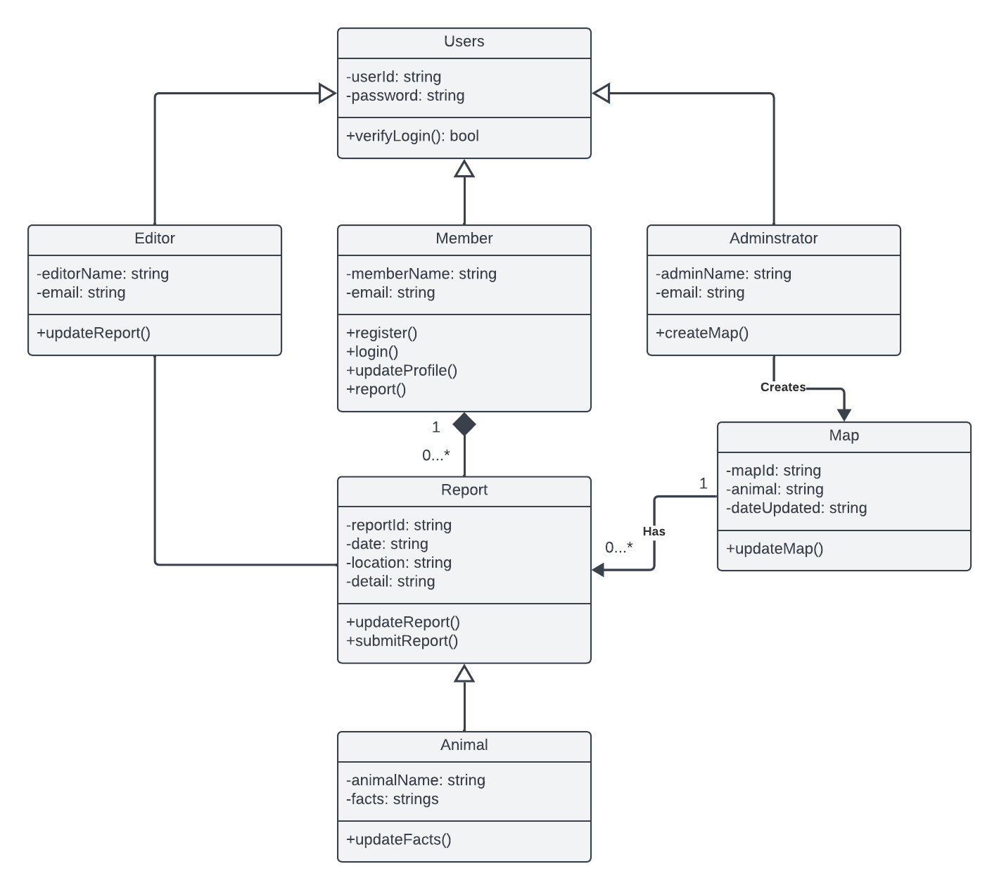
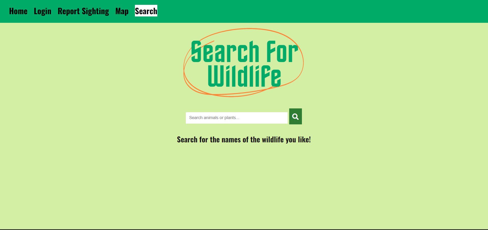
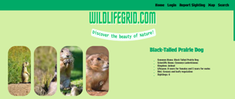
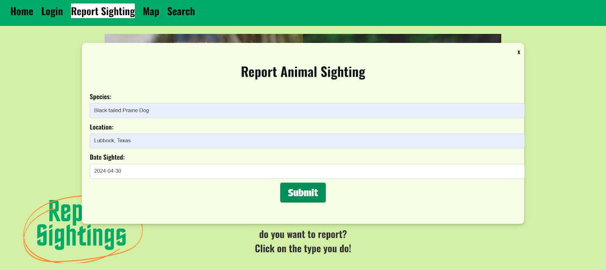
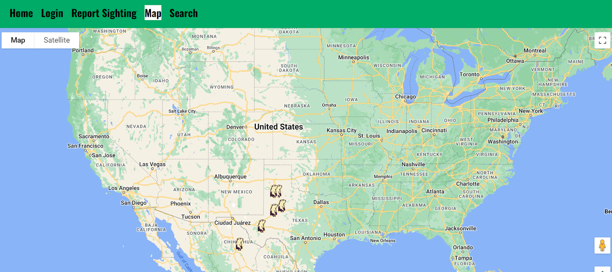

# WildlifeGrid - Animal and Plant Distribution System

## Overview

WildlifeGrid is a web-based platform designed to monitor the growth and migration of various flora and fauna. By leveraging user reports and mapping technology, it aims to raise awareness about local ecosystems and contribute to conservation efforts.

### Technologies Used
- Front-end: HTML, CSS, JavaScript (Google Map JavaScript API)
- Back-end: Database (SQL), Server-side scripting

## Features

### **1. User Interaction**

- **Sign-Up and Login System**: Secure authentication with username and password verification.
- **Report Sightings**: Users can submit wildlife sightings, updating the database accordingly.
- **Search Functionality**: Auto-complete search to find specific species in the database.

### **2. Mapping and Data Visualization**

- **Google Maps API Integration**: Displays reported sightings with markers.
- **Dynamic Species Tracking**: Users can see migration trends and biodiversity insights.

### **3. Wildlife Information**

- **Black-Tailed Prairie Dog Page**: Example of species reports and conservation efforts.
- **Database of Flora and Fauna**: Provides species information, location data, and sightings history.

## Technical Implementation

### **Database Structure**

- **Species Table**: Contains species details, scientific names, and sightings count.
- **Sightings Table**: Stores reports with location, date, and species ID references.
- **Users Table**: Maintains user credentials and account information.

### **UML Diagrams**

- **Class Diagram**: Defines user roles (Members, Editors, Administrators) and data relationships.
- **Use Case Diagram**: Outlines user interactions with the system.
- **Sequence Diagram**: Illustrates how users and the system interact dynamically.

## Challenges and Solutions

### **1. Species Recognition**

- Implemented a dropdown list for species selection to avoid incorrect entries.
- Admin verification process added for accuracy.

### **2. Mapping and Location Data**

- Developed a city-based latitude/longitude database for precise marker placement.
- Currently using manual marker entry but aims to automate in the future.

### **3. Data Entry Limitations**

- Due to resource constraints, only a limited dataset was implemented.
- Future improvements will involve expanding the database for better functionality.

## Impact and Future Goals

### **1. Educational Opportunities**

- Provides an accessible learning tool about local wildlife and biodiversity.

### **2. Conservation and Research**

- Contributes data for wildlife conservation organizations.
- Helps track species migration and environmental changes.

### **3. Future Enhancements**

- Automate marker generation for reported sightings.
- Expand species database for a more comprehensive dataset.
- Implement machine learning for species identification based on image uploads.

### **4. Pictures of Website**

